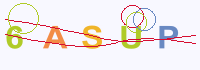
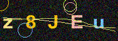
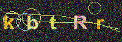
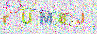
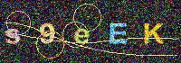
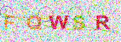

# captcha-rs

[](https://crates.io/crates/captcha-rs)
[](https://github.com/samirdjelal/captcha-rs/actions/workflows/test.yml)
[](https://github.com/samirdjelal/captcha-rs/issues)
[](https://crates.io/crates/captcha-rs)
[](LICENSE)
[](https://docs.rs/captcha-rs)
[](https://deps.rs/repo/github/samirdjelal/captcha-rs)

**captcha-rs** is a library that generate verification images dynamically.

Example pictures are as follows:

 |  | 
--- | --- | ---
 |  | 

### Using complexity method

Complexity | Dark Mode / Noise Filter | Light Mode / Noise Filter
--- | --- | ---
Level 1 |  | 
Level 2 |  | 
Level 3 |  | 
Level 4 |  | 
Level 5 |  | 
Level 6 |  | 
Level 7 |  | 
Level 8 |  | 
Level 9 |  | 
Level 10 |  | 


## Example

Add the following dependency to the Cargo.toml file:

```toml
[dependencies]
captcha-rs = "0.2.6"
```

And then get started in your `main.rs`:

```rust
use captcha_rs::CaptchaBuilder;

fn main() {
	
	let captcha = CaptchaBuilder::new()
		.length(5)
		.width(130)
		.height(40)
		.dark_mode(false)
		.complexity(1) // min: 1, max: 10
		.build();
	
	println!("text: {}", captcha.text);
	println!("base_img: {}", captcha.base_img);
	
}
```

### Run

```bash
# Dev
💲 cargo run

# Build
💲 cargo build

# Test
💲 cargo test -- --nocapture
```

## License

This project is licensed under the [MIT license](LICENSE).

### Contribution

Unless you explicitly state otherwise, any contribution intentionally submitted for inclusion in `captcha-rs` by you, shall be licensed as MIT, without any additional terms or conditions.
