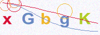
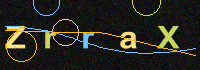
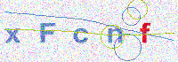
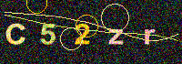
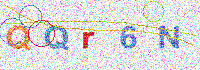
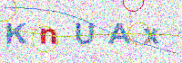
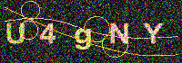
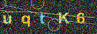

# captcha-rs

[](https://crates.io/crates/captcha-rs)
[](https://github.com/samirdjelal/captcha-rs/actions/workflows/test.yml)
[](https://github.com/samirdjelal/captcha-rs/issues)
[](https://crates.io/crates/captcha-rs)
[](LICENSE)
[](https://docs.rs/captcha-rs)
[](https://deps.rs/repo/github/samirdjelal/captcha-rs)

**captcha-rs** is a library that generate verification images dynamically.

Example pictures are as follows:

 |  | 
--- | --- | ---
 |  | 

### Using complexity method

Complexity | Light Mode / Noise Filter                        | Dark Mode / Noise Filter
--- |--------------------------------------------------| ---
Level 1 |   | 
Level 2 |   | 
Level 3 |   | 
Level 4 |   | 
Level 5 |   | 
Level 6 |   | 
Level 7 |   | 
Level 8 |   | 
Level 9 |   | 
Level 10 |  | 

### Using Visual Enhancements and Bot Deterrence

Effect | Image example
--- | ---
Drop Shadow | 
Heavy Interference | 
Mild Distortion | 
Heavy Distortion | 

## Example

Add the following dependency to the Cargo.toml file:

```toml
[dependencies]
captcha-rs = "0.3.0"
```

And then get started in your `main.rs`:

```rust
use captcha_rs::CaptchaBuilder;

fn main() {
	
	let captcha = CaptchaBuilder::new()
		.length(5)
		.width(130)
		.height(40)
		.dark_mode(false)
		.complexity(1) // min: 1, max: 10
		.compression(40) // min: 1, max: 99
		.drop_shadow(false) // Adds a drop shadow to the text
		.interference_lines(2) // Number of interference lines (min 0)
		.interference_ellipses(2) // Number of distraction circles (min 0)
		.distortion(0) // Level of wavy distortion grid (min 0)
		.build();
	
	println!("text: {}", captcha.text);
	println!("base_img: {}", captcha.to_base64());
	
}
```

### Run

```bash
# Dev
💲 cargo run

# Build
💲 cargo build

# Test
💲 cargo test -- --nocapture
```

## Performance

The library is highly optimized for fast image generation. The table below represents benchmarks tested with varying configurations (measured per image):

| Configuration | Time per Image | Core Settings |
| --- | --- | --- |
| **Default** | `~53 µs` | length=5, 130x40 |
| **High Complexity** | `~439 µs` | length=5, 200x70, complexity=10 |
| **High Distortion** | `~160 µs` | length=5, 200x70, distortion=15 |
| **Extreme Security** | `~1.16 ms` | length=8, 300x100, complexity=10, distortion=20, drop_shadow, high interference |

*Note: Benchmarks run on a single thread using `cargo bench`. Performance will vary based on hardware, but standard generation should easily exceed thousands of images per second.*

## License

This project is licensed under the [MIT license](LICENSE).

### Contribution

Unless you explicitly state otherwise, any contribution intentionally submitted for inclusion in `captcha-rs` by you, shall be licensed as MIT, without any additional terms or conditions.
